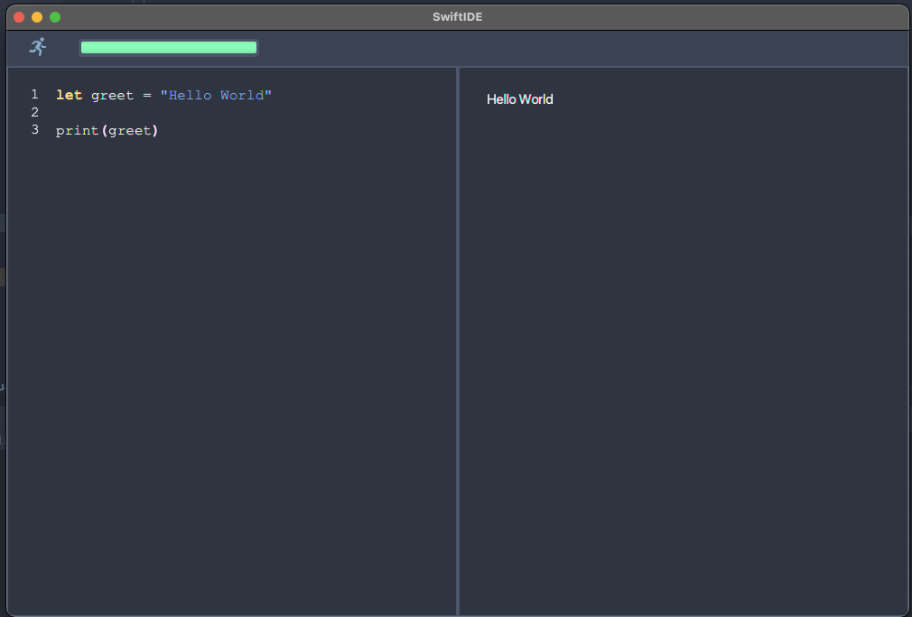
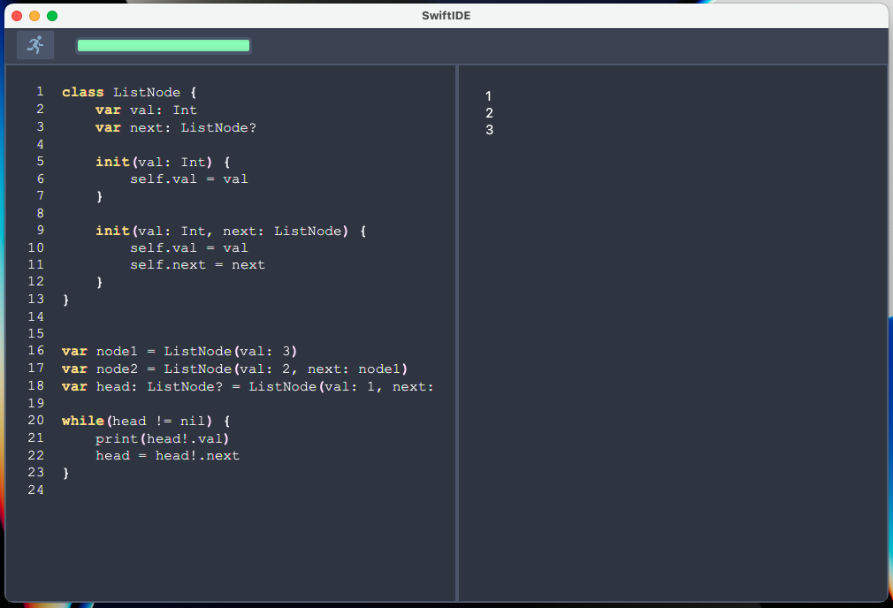

# SwiftIDE 

SwiftIDE is a light weight IDE for Swift. It is only ment for testing not actual development. 

### Features
- Syntax highlighting
- Input/Output panel
- line numbering 

## How to run the project
The Project is build with Intellij IDEA. 

You need to have the following installed:
- [JavaFx 17.0.2](https://gluonhq.com/products/javafx/)
- [Java 17.0.2](https://www.oracle.com/java/technologies/downloads/)

Open the project in Intellij and go to > src > java > com.example.swiftide > Launcher.java > run

### You are now ready to Go and to start writing swift scripts

### LinkedList example

## Implementation 

### Classes 

- SwiftCompile 
    - create & write to .swift file 
    - run file using /usr/bin/env swift 
- SwiftIDE 
    - load data from .fxml & .css files
    - creating the scene
- SwiftController
    - handles keyboard & button input events 
- SwiftKeywords
    - stores Keywords
    - handles logic for syntax highlighting 
- Launcher
    - starting point of the application 
  
### Features 

- All the required functionality
- Language keyword highlighting 
- Progressbar for the running script 
